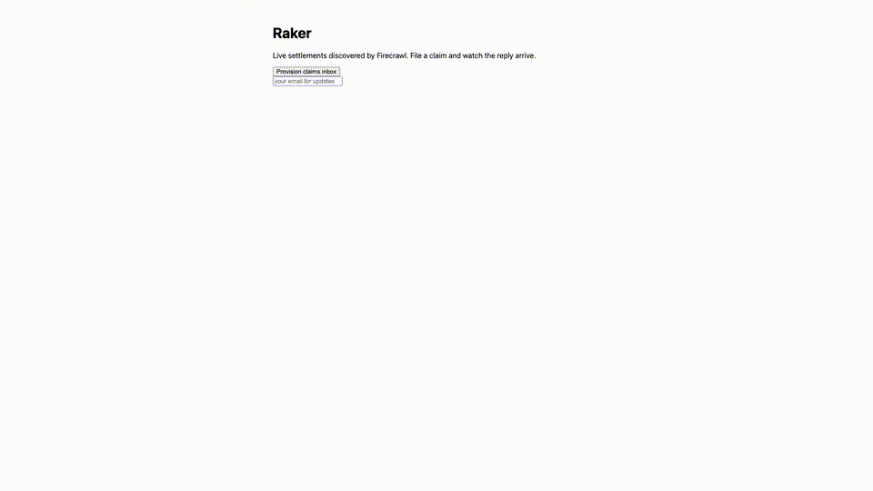

# Raker

Finds class-action settlements you qualify for, files the claim by email, and tracks the administrator's reply live.



**Live:** https://vivid-toad-855.convex.site · **Demo video:** docs/demo.mp4 · **Built at:** Convex All Gas Hackathon (Aug 25 – Sep 22, 2026)

## What it does

Raker crawls public settlement-tracker sites for open class-action settlements and shows them on a live dashboard. You pick a settlement, Raker files the claim by email from its own inbox, and the administrator's reply flips the claim's status live. Built for the demo path in `docs/demo-path.json`.

## How it works

A Convex application: Firecrawl runs durable crawls over settlement-tracker sources and a JSON extraction prompt turns listings into `settlements` rows; reactive queries drive the dashboard with no polling. AgentMail sends the claim-filing email and its webhook ingests the reply, updating the claim. The Vite frontend is served from the same deployment via static hosting.

## Bounties targeted

- **Convex — real backend, live sync**: `convex/schema.ts` (sources/settlements/claims), reactive `settlements.list` + `claims.listForSettlement`, deployed to `convex.site`
- **Firecrawl — real crawl, not a one-shot scrape**: `convex/crawl.ts` durable `startCrawl` with JSON-mode extraction, `onCrawlComplete` writes rows
- **AgentMail — send + receive, not decoration**: `convex/claims.ts` sends from the app's own inbox; `convex/email.ts` `onMessageReceived` ingests the reply and flips status live

## Running it

```bash
npm install
npx convex dev          # creates your dev deployment, generates convex/_generated
npx convex env set FIRECRAWL_API_KEY fc-...
npx convex env set AGENTMAIL_API_KEY am_...
npm run dev:frontend    # Vite dashboard (backend: npm run dev:backend)
npm run build           # production frontend
npx convex deploy --yes # backend to production
CONVEX_DEPLOYMENT="prod:<id>" npx @convex-dev/static-hosting deploy --dist dist --skip-convex --skip-build
```

## What is not built

Everything not on the demo path (see `docs/demo-path.json`) is stubbed, hardcoded, or deleted. That is the correct prioritisation under a deadline, not technical debt. Specifically: no auth (single shared claims inbox), extraction tuned against Top Class Actions HTML only, reply-matching falls back to oldest-unanswered-claim when no thread is linked yet.

## Credits

Illustrations and other vendored assets, with the attribution their licenses require, are listed in `CREDITS.md`.
